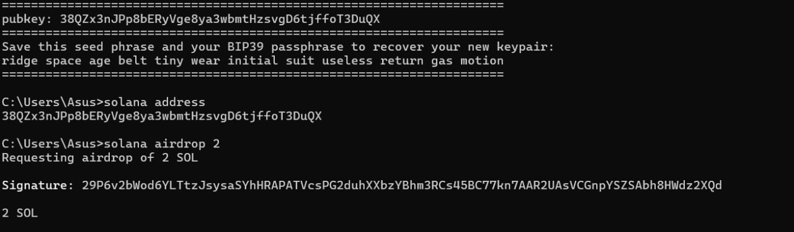

## Solana Hello World Smart Contract
This project demonstrates the basic deployment of a Rust-based smart contract (Hello World) on the **Solana Devnet** using the Solana CLI.

## ⚙️ Installation Steps

# 1. Installed Solana CLI manually from GitHub release
solana --version

# 2. Set up Devnet and created a wallet
solana config set --url https://api.devnet.solana.com
solana-keygen new
solana airdrop 2

# 3. Cloned the Hello World example project
git clone https://github.com/solana-labs/example-helloworld.git
cd example-helloworld

# 4. Installed Rust and added BPF component
rustup install stable
rustup component add rust-src

# 5. Installed necessary npm dependencies
npm install

# 6. Built the smart contract
npm run build:program-rust

# 7. Deployed the program to Devnet
solana program deploy dist/program/helloworld.so

---

## 💡 Program Details

- **Wallet Address:** `38QZx3nJPp8bERyVge8ya3wmbtHzsvgD6tjffoT3DuQX`  
- **Program ID:** `BMG1DEhdfd5148A5tiN3ZVuaBTTmro7U6UiN1rmsFBuG`  
- **Explorer Link (Devnet):**  
  [Click to view](https://explorer.solana.com/address/BMG1DEhdfd5148A5tiN3ZVuaBTTmro7U6UiN1rmsFBuG?cluster=devnet)
---

## 🧪 Screenshots

### ✅ Solana CLI Version

### ✅ Wallet Address & Airdrop

### ✅ Program Compilation

### ✅ Successful Deployment

### ✅ Explorer View (Devnet)

---

---

